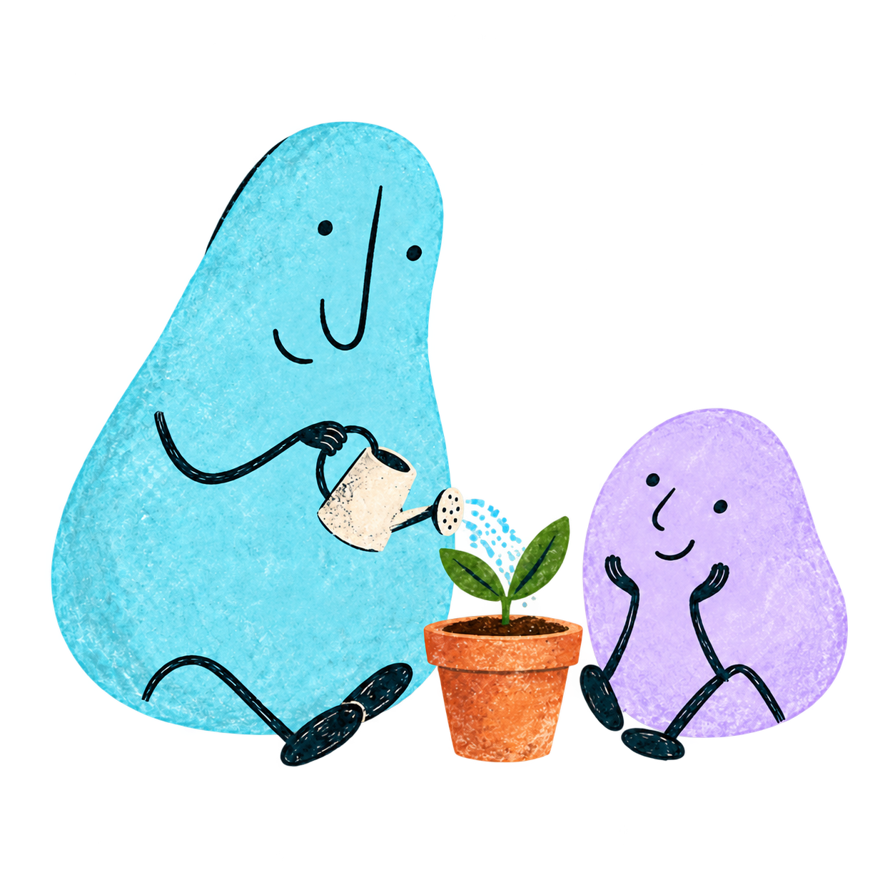

<div align="center">
  
  <h3>Play. Practice. Progress at your own pace.</h3>
  <p>Games and interactive challenges for a little time to yourself, every day.</p>
  <p>
    <a href="https://github.com/Bysplays/app-ictus/actions/workflows/deploy.yml"></a>
    
    
    
  </p>
  <p>
    <a href="https://bysplays.github.io/app-ictus/">Open NeuroIA</a> ·
    <a href="#project-portals">Project portals</a> ·
    <a href="#local-development">Local development</a>
  </p>
  
  <p><sub>Every small step counts.</sub></p>
</div>

---

## A space to practice

NeuroIA is a **serious play** platform with nine games covering attention,
memory, language, organization and coordination. Daily sessions, achievements
and personal progress support practice without competing against other people.

| At your pace | Your way | With you |
| :--- | :--- | :--- |
| Daily sessions and individual games | Text sizes and Default / Cozy styles | Google sign-in and account-linked progress |
| Pauses, help and instructions | Optional wellness companions | Seven-day trial, invitation or monthly plan |

The app is in Spanish. The [professional workspace](docs/PROFESSIONALS.md) is free;
paid seats fund participants who redeem a unique code and share read-only activity.
Professional rules and Worker deployment must precede frontend release.

## Project portals

- [Firebase](https://console.firebase.google.com/)
- [Google Cloud](https://console.cloud.google.com/)
- [Stripe](https://dashboard.stripe.com/)
- [Cloudflare](https://dash.cloudflare.com/)
- [GitHub](https://github.com/)

## Local development

Use **Node.js 22 or later** and npm.

```sh
npm ci
npm run dev
```

Open the address printed by Vite, usually `http://localhost:5173`.
Sign-in uses Google and the configured Firebase project; there is no mock login.
See [authentication setup](docs/AUTHENTICATION.md) for domains and permissions.

To connect the frontend to the test billing Worker, create `.env.local`:

```dotenv
VITE_BILLING_API_URL=https://neuroia-billing.kikefontanlorenzo.workers.dev
VITE_STRIPE_ENABLED=true
```

These variables are public. Stripe private keys, the webhook signing secret and
the Firebase service account belong **only in Worker secrets**.
See the [billing guide](vendor/cloudflare/README.md) for the complete setup.

## Checks

```sh
npm run build
npm run lint
npm test
node --test vendor/cloudflare/index.test.mjs
npm run test:firestore
```

Firestore tests use only the `demo-neuroia` emulator and require Java 21+.
The linter still reports known game warnings; see [AGENTS.md](AGENTS.md) for
current tooling limitations and additional backend checks.

## Deployment

| Frontend | Billing | Security |
| :--- | :--- | :--- |
| GitHub Pages through Actions on pushes to `main` | Cloudflare Worker deployed separately | Firestore rules published separately |

The Pages build supports `/app-ictus/` and custom domains. Set
`VITE_BILLING_API_URL` and `VITE_STRIPE_ENABLED` in Actions variables to enable
billing in that build. Publishing the frontend **does not deploy the Worker or
Firestore rules**. Stripe is configured for testing; validate the full payment
lifecycle before enabling live charges.

## Documentation

| Guide | Contents |
| :--- | :--- |
| [Design](docs/DESIGN.md) | Visual identity, interaction and accessibility |
| [Content](docs/CONTENT.md) | Product language and approved copy |
| [Onboarding](docs/ONBOARDING.md) | Access, invitations and subscriptions |
| [Authentication](docs/AUTHENTICATION.md) | Google sign-in and Firestore progress |
| [Cloudflare](vendor/cloudflare/README.md) | Worker deployment and daily reconciliation |
| [Stripe](vendor/stripe/README.md) | Checkout, subscriptions and sandbox setup |
| [Firebase](vendor/firebase/README.md) | Security rules and legacy Functions |
| [Contributing](CONTRIBUTING.md) | Branches, commits and merges |
| [Agent guide](AGENTS.md) | Architecture and development practices |
| [Roadmap](docs/TODO.md) | Pending work and validation |

See the [brand guide](docs/assets/brand/README.md) and
[illustration provenance](docs/assets/images/headers/README.md). Reuse the existing
wellness companions to keep the visual identity consistent.
Current ElevenLabs recordings require attribution and are restricted to
non-commercial use; see the [audio documentation](docs/assets/audio/elevenlabs-v3/README.md).

<div align="center">
  <br />
  
  <p><strong>Every day counts.</strong></p>
</div>
