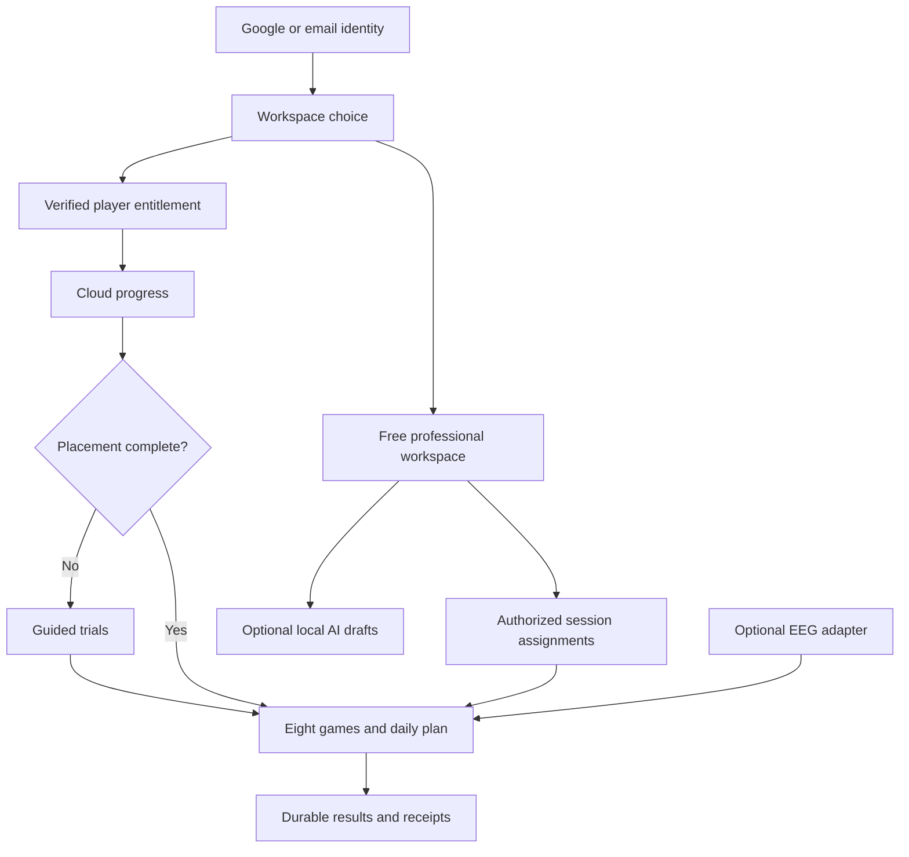

# NeuroIA — Software Design Document

Status: implementation specification, not a claim that the proposed features ship.
Baseline reviewed: 2026-09-27. Daily-action retirement and supplied-logo integration
are implemented. Email/password entry is implemented locally with production activation
pending for the frontend and live email delivery; backend protections and the
Firebase email provider are deployed. The other feature specifications below remain planned. Product priorities and remaining delivery work are
tracked in [TODO.md](TODO.md). Existing behavior is documented in [AGENTS.md](../AGENTS.md),
[DESIGN.md](DESIGN.md), [CONTENT.md](CONTENT.md) and the linked integration guides.

## 1. Purpose and scope

Extend the Spanish-language serious-play app with optional Bluetooth EEG,
reliable monthly professional seats, local AI-assisted reports/notes,
professional-assigned sessions, email authentication, complete natural narration,
the supplied brand mark, recognizable illustrated objects, ten difficulty levels
and guided initial placement. Retire daily action sequencing; retain the memory
beacon sequence game. The target catalog contains eight games across five areas.

Levels describe performance within these games. Adaptation aims to keep practice
appropriately challenging; neither a level increase nor EEG output establishes
cognitive improvement, diagnosis or medical efficacy. Public copy must follow
CONTENT.md and describe only implemented, verified capabilities.

Priority order follows the owner: EEG, seats, AI, assigned sessions, email,
voices, logo, game illustrations, difficulty, placement, game retirement.
Implementation dependencies can change scheduling without changing those priorities.
No SDK, language model, inference runtime or replacement voice provider is selected.
The mention of NVIDIA voice repositories is a future research lead, not a verified
recommendation. Research primary sources and licenses when selecting dependencies.

## 2. Current implementation and gaps

| Area | Implemented baseline | Gap |
| --- | --- | --- |
| App | React/TypeScript/Vite, React-state navigation, shared game clock and dialogs | No new router required |
| Identity | Google and email/password entry, verification/recovery and same-UID password setup | Provider activated; frontend publication and live delivery remain unverified |
| Progress | Firestore authority, transactional receipts, durable per-account outbox; versioned placement | Physical-device/release verification |
| Games | Eight catalog entries; daily actions retired with history preserved | Parameterize eight games |
| Levels | Eight games consume versioned levels 1–10; guided initial trials and bounded adaptation | User calibration, tracking adaptation and explicit reassessment |
| Professionals | Free workspace, paid-seat links, read-only charts/history | Versioned session proposals implemented; private note-writing remains pending |
| Billing | Worker Checkout, signed webhooks, reconciliation, portal, seat redemption/rotation | Production deployment and sandbox lifecycle not fully verified |
| Access | Server-owned entitlement records; browser refresh on focus/every 30 seconds | Worker-confirmed time and expiry; 60-second lease, fail-closed refresh; Worker deployed, real-account lifecycle pending |
| Narration | Shared recorded-player service and browser fallback | 91/370 clips missing; full audition and commercial rights unresolved |
| EEG / AI | No connected SDK or browser inference | Discovery, implementation and validation required |
| Brand / objects | Supplied mint mark integrated; existing paper sprite atlases | New object style pending integration |

Historical result IDs, totals, achievements and account data remain compatible.
A frontend build deploys neither Worker code nor Firestore rules. Local tests do
not prove the live environment has the reviewed behavior.

## 3. Architecture and boundaries

Reuse `App`, `AccountEntry`, `AccessGate`, `CloudProgress`, `GameSession`,
`ExerciseWrapper`, `ModalFrame`, `ProgressSync`, `StorageService` and the shared
sound/artwork services. Firebase Authentication identifies the UID; Firestore
rules and the Worker enforce permissions. Stripe-derived server state owns paid
access. UI state, a selected workspace, a URL parameter and AI output grant no rights.

Proposed additions:

- A difficulty service with pure, versioned game configurations and adaptation.
- A placement flow after successful player access/progress loading and before
  ordinary game entry. Professional-only entry remains free and has no placement gate.
- A professional session/notes adapter with explicit Firestore authorization.
- An optional EEG transport adapter, isolated from game logic.
- A lazy browser-inference worker, isolated from rendering and the game clock.

## 4. Feature specifications and acceptance

### EEG — optional headband

Dependency: owner supplies SDK, device identity, protocol and usable license.
Do not assume a device model or compatibility from old marketing text. Determine
whether the SDK can operate in the target browser before committing to transport.

Adapter states: unsupported, disconnected, requesting permission, connecting,
connected, reconnecting and error. Expose timestamped samples, signal quality and
connection events through a bounded subscription interface. Normalize units only
from SDK documentation. Clean up listeners and buffers on disconnect/sign-out.

Connection must follow an explicit user action. Missing hardware, rejected
permissions or lost signal must not block ordinary play. Show quality/connection
status without inferring mental state. Proposed default: keep samples transient;
recording/export requires a defined purpose, retention and explicit user choice.
No automatic EEG-driven difficulty until its mapping has been separately specified.

Acceptance: test actual hardware, denial, unsupported device/browser, interruption,
reconnection and application backgrounding. Record the supported OS/browser/device
matrix and measured sample handling. Simulated samples are insufficient for sign-off.

### SEATS — monthly purchases and continuous validity

One paid monthly subscription funds one seat and one participant. Keep the
professional dashboard free. Reuse routes, paths and idempotency described in
[PROFESSIONALS.md](PROFESSIONALS.md) and [Worker setup](../vendor/cloudflare/README.md).

| State | Unused code | Linked participant | Professional activity access |
| --- | --- | --- | --- |
| Pending/unpaid | Cannot redeem | No seat-derived play | Denied |
| Active, paid and unoccupied | One atomic redemption | Not yet assigned | No participant link |
| Active, paid and occupied | Cannot assign another person | Play allowed | Read only for linked owner |
| Cancel at period end, still paid | Valid while seat remains eligible | Until confirmed paid-through date | Same paid-through boundary |
| Expired, revoked or failed entitlement validation | Cannot redeem | Block new/continued play | Denied |
| Participant departs | Old code invalid; rotate if seat remains paid | Seat access removed; progress retained | Link removed |

Signed webhook/reconciliation updates must consult authoritative subscription,
customer, price, quantity and payment state, with server time. Duplicate and
out-of-order events cannot extend unpaid access, resurrect old codes or relink
someone who left. Preserve the separate CEOABERTO permanent reusable exception;
changing it requires an explicit migration decision.

Use the authenticated Worker `/access` response with server time and confirmed
expiry. The implemented maximum lease is 60 seconds, capped by paid expiry, with
refresh every 30 seconds; a failed refresh closes access immediately. Use monotonic elapsed time
for the local lease, revalidate on focus/resume, and pause access when the lease
cannot be renewed. A device clock rollback must not extend permission. Preserve
pending legitimate result writes without treating those writes as permission to play.
The professional analytics rules independently enforce occupancy and server expiry.
Static downloadable frontend assets are not a DRM boundary.

Acceptance: real sandbox purchase, abandoned/retried Checkout, concurrent code
claims, used/unused expiry, failed renewal/recovery, immediate cancellation,
period-end cancellation, refund/revocation policy, departure/reassignment,
clock manipulation, offline refresh, open-tab expiry and sleep/resume. Payment
failure semantics and refund policy must be explicit before live billing.

### AI — local assistance for reports and notes

First deliver manual notes/reports with explicit permissions; the current legacy
therapist component does not authorize professional writes. Keep private notes
separate from participant-visible reports and instructions.

Evaluate small Llama/Gemma-style models without preselecting a version. Compare
Spanish quality, grounding, download size, memory, device performance, runtime
support and commercial license using representative target hardware. A runtime
capability probe decides availability. Load model assets only after an informed
user action showing size; inference runs outside the UI thread and is cancelable.
Provide manual editing when unavailable, download fails or the model cannot fit.
Do not introduce remote inference as a silent fallback.

Supply only the selected person's authorized activity and selected notes, with
explicit date range, partial-history coverage and record references. Treat note
contents as data, never instructions that override the summarization task. Missing
activity produces an honest empty state. Drafts must distinguish measured data
from proposed wording, use neutral Spanish, and contain no invented diagnoses,
results, efficacy claims or treatment instructions. A professional reviews/edits
and explicitly saves a draft; generation does not publish or assign a session.

Acceptance: unsupported/low-memory devices, canceled/download-failed generation,
Spanish factuality review, empty/partial data, malicious instructions in notes,
sign-out/data-switch cancellation, and no activity/notes transmitted for inference.
Store model/configuration version and source coverage with an accepted report.

### SESSIONS — professional-assigned game sequences

An active linked owner selects a person, an ordered list of active games,
bounded levels and optional neutral instructions. Preview the sequence before
publishing. Participants see who proposed it and can start, pause, resume or leave.
Keep assigned sessions distinct from the automatic daily plan and its counters.

Implemented lifecycle: local draft, assigned, in-progress, completed, cancelled.
Publishing freezes the title, message, ordered games, numeric levels and configuration
version. Changing a published proposal requires cancellation and a new proposal;
there is no mutable revision that can replace a running game. Proposals contain
1–8 games, including duplicates, an 80-character title and an optional 280-character
message. Levels are fixed during the proposal and do not feed personal level adaptation.
Seat expiry/departure blocks access and new assignments; recovery resumes only if
the reciprocal relationship and proposal remain valid. Game retirement/version
migration remains a release gate for future catalog changes.

Only the linked owner authors/cancels assignments. Only the participant starts
and advances them. Each step first saves an ordinary durable exercise result with
a deterministic ID; a separate transaction checks that archived result against
the expected game, level, configuration and position before advancing. Resume
reconciles results saved before a crash. Duplicate devices cannot count the same
step twice. Cancellation never prevents an already completed exercise from being
saved in ordinary activity. Professionals never write participant progress.

Professional history shows the latest 50 proposals. Participant entry queries up
to 50 pending proposals, so completed history cannot hide an older pending session.
Older professional-history pagination remains pending. Browser fixtures verify
ordering, fixed levels, pause/resume, completion and dialogs; emulator tests cover
concurrent devices, receipt recovery, cancellation, expiry and cross-account denial.
Production publication and physical-device checks remain separate release gates.

### EMAIL — additional authentication

Implemented with email/password. The owner prefers magic links where practical,
but authorized password fallback; the current Spark project allows only five
sign-in emails per day, so links remain deferred without changing billing. Keep Google
and existing UID/workspace semantics. Registration/sign-in preserve the chosen
workspace before verification; recovery returns a neutral confirmation only
after Firebase accepts the request. Password requirements are checked against
the configured Firebase policy. Passwords stay in the form/SDK, never app storage.

Unverified password accounts see an explicit send/recheck/logout screen before
either workspace. Rechecking reloads the user and forces an ID-token refresh.
Firestore and Worker enforcement require verified password-provider tokens before
data access, trials, links or billing. Existing Google-provider behavior remains.
Verification and password reset use Firebase's hosted action pages, including
invalid/expired-code handling; the app does not consume action codes from URLs.

Settings add a password to the authenticated Google user's existing email/UID
using `updatePassword`, followed by provider/token refresh. Recent-login errors
offer explicit Google reauthentication and a retry. Never merge account histories
solely because email strings match. Auth emulator coverage verifies same-UID entry
with both methods. Publish rules/Worker before enabling the real email provider;
see [AUTHENTICATION.md](AUTHENTICATION.md) for the remaining activation checks.
Acceptance: existing Google identity, new email identity, incorrect/expired
credentials or links, recovery, sign-out/restoration and independent professional
entry. Configure real authorized domains and verify on the target devices.

### VOICE — natural Spain-Spanish recordings

Preserve the exact pending inventory in TODO and the audio provenance files.
Re-inventory live speech after game retirement/copy changes before spending credits;
obsolete recordings need not be generated merely to complete the old count.
Evaluate ElevenLabs and any alternative, including the suggested NVIDIA research,
against audible es-ES pronunciation, natural delivery, accessibility pace and rights.
Do not claim an alternative exists or is suitable until its source is reviewed.

Reuse recording lookup, player cancellation, one completion callback, independent
effect/narrator toggles, Vite base paths and browser-speech fallback. Do not regenerate
accepted clips without cause. Current free-plan files are not commercially cleared.
Acceptance: listen to every adopted clip, including segmented words; validate
mapping, cancellation, missing/corrupt playback and licensing/attribution.

### BRAND and ART — identity and recognition

Use the owner's [supplied mint organic branching mark](assets/brand/supplied-mark.png)
as the replacement reference;
do not treat the image as instructions or infer product capabilities from it.
Preserve its proportions. Retain a durable original, document provenance, and
produce suitable wordmark, favicon and installation variants without guessing a
new visual identity. The supplied transparent PNG is embedded unchanged in the active SVG layouts;
installation PNGs are browser rasterizations. No image generation was used.

Game-object direction: more realistic recognizable illustrations/pictograms,
without replacing the approved companion family. Approve a small sample first,
then inventory every stimulus and map it through the shared artwork renderer.
Preserve answer keys, target/example identity and color cues. Brand/mascot/art
visibility must respect existing theme and companion settings.
Acceptance: all crops/mappings, transparent edges, small-size legibility, both
styles, contrast, large text, app install icons and Pages base paths.

### LEVELS — game difficulty 1–10 (implemented, calibration provisional)

`difficulty.ts` version 1 supplies ten bounded parameter rows for all eight games.
`GameSession` initializes from the per-game recommendation and lets the player choose
1–10 before starting. It freezes the choice for play and repeat; no mid-game changes.
Every new result records `level`, `configVersion`, `hintsUsed` when relevant and
`practice`. Legacy domain levels and old results remain readable and unchanged.

| Game | Version 1 controls, level 1 → 10 |
| --- | --- |
| Visual scanning | 2×3 → 6×6 board, existing target identity and at least three targets |
| Object naming | 3 → 8 questions; 8 → 30-item pool; gentle/moderate/challenge distractors; 2–3 choices |
| Word completion | 3 → 8 questions; 8 → full 28-item pool; 2 → 4 letter choices; one missing letter |
| Memory beacons | 2 → 6 steps per sequence; 1300 → 800 ms per step; three rounds |
| Memory pairs | 2 → 6 pairs; 8 → 3-second preview |
| Categorization | 3 → 8 questions; 8 → full 28-item pool; existing two unambiguous groups |
| Static targets | 5 → 14 targets; 160 → 88 px diameter, clamped inside arena |
| Moving target | 0.06 → 0.24 percentage-points/16 ms; 6 → 15 seconds of accumulated contact; 160 → 88 px |

Exact intermediate rows live in the pure configuration function and are covered by
bounds/distinctness tests. These are initial game-design settings, not validated
ability measures. Review vocabulary ordering, pacing and physical-device comfort
with users before considering calibration complete.

Three eligible normal results at the current recommended level consume one evidence
window. Mean accuracy ≥85% promotes one level; <60% reduces one; otherwise retain.
Hints or answer-revealing audio cap a session's promotion evidence at 84%. Require
at least three answers/attempts (two for pairs). Easier/harder manual sessions,
older configuration versions, placement, duplicates and aborted games do not change
the recommendation. Receipts protect replay across the bounded history window.
Memory pairs use matched pairs / attempts, not a fabricated perfect result.
A repeat-preview action counts as a hint; larger decks use more columns on wider
viewports, and preview time counts as active game time.
New scanning, memory and motor results no longer floor accuracy at a positive value.
Historical records are untouched. Moving-target adaptation is deliberately manual:
contact ratios across keyboard/pointer methods are not comparable enough to infer
an automatic recommendation. Keyboard holding is an explicit accessible alternative.

### PLACEMENT — initial guided level assessment (implemented)

Player entry after access and cloud loading requires version-1 completed placement
and valid per-game levels. Professional entry has no placement gate. The shared game
renderer supplies an unscored level-1 example then a short level-3 trial for each of
the eight games. Naming, words and categories have three questions; beacons three
rounds; pairs three pairs; scanning a 3×3 board; static targets six; tracking six
seconds accumulated contact. Instructions, help, optional narration, companions,
landscape pauses and settings use the existing systems.

A completed trial queues a durable `placement` operation. Its evidence and provisional
game level are written in the progress transaction; the eighth trial atomically
marks the full set complete. The first committed evidence for each game wins;
retries and another device cannot overwrite it. Placement never writes result
archives or increments ordinary activity, achievements, streaks or daily plans.
Pausing preserves the mounted trial and its clock. Returning/reloading resumes the
first unfinished game; only that incomplete trial restarts.

Trial accuracy ≥85% without hints assigns level 4, ≥60% assigns level 3, otherwise
level 1. Require at least three attempts. An explicit inaccessible-trial action
records `skipped`, no measured evidence and level 1. Tracking always starts at level
1 with a manual selector. The final screen discloses skipped games and shows all
levels. Completed placement does not repeat on sign-in. Local imports intentionally
omit placement; only existing cloud placement bypasses it. A separate explicit
reassessment flow remains a follow-up; choosing a different single-game level is
already available.

### RETIRE — daily action sequencing

Implemented: the following remains the compatibility contract.

Remove `DailySequencingGame` from active dispatch/catalog/daily plans and remove
its unused executable implementation once references are cleared. Organization
must open categorization. Retain memory-path sequencing.

Separate the active catalog from historical display metadata so `daily-seq` and
`daily-sequencing` keep names, colors and filters in statistics. Preserve old
results, totals, earned badges and original audio/assets needed for historical
compatibility. Do not rewrite past records as categorization. Update game counts
and speech inventories; validate daily-plan progression and saved legacy entries.

## 5. Proposed data contracts and migrations

Placement, difficulty, result metadata and assignments are implemented locally;
notes, reports and EEG contracts remain proposed. Production deployment is tracked in TODO.

| Data | Proposed location / contents | Authority |
| --- | --- | --- |
| Placement | Optional progress.profile.placement: version, completed, per-game trial evidence; cursor derived from first missing game | Participant via validated durable operations |
| Difficulty | Versioned per-exercise level/evidence map in progress; legacy fields retained | Progress transaction/reducer |
| Results | Optional numeric level, configuration version, assignment/owner/seat/step IDs | Participant; existing result ID/receipt semantics |
| Assignments | `professionals/{owner}/seats/{seat}/participants/{uid}/sessions/{id}`; immutable published body | Active linked owner authors; participant step receipts only |
| Private notes | Separate professional-owned note documents, participant association and timestamps | Authoring owner only under active-link rules |
| Reports | Reviewed report documents with source references, model version and sharing state | Explicit owner save/share; participant reads shared versions only |
| EEG | Bounded transient device buffer by default | Local adapter; no cloud writes by default |

Do not put private notes in the participant progress document: linked professionals
can read that whole document today. Define deletion/retention and expired-link
note access before enabling storage. Default to denying new access after link
loss; retained owner-authored records require a separately approved policy.

Extend `ProgressOperation`, reducer validation, outbox replay and Firestore rules
together for placement/difficulty. Preserve permanent receipts and idempotent
results. Migrate lazily with an explicit schema/version marker; absence means
unassessed, never erase historical totals or silently treat 1–3 as calibrated 1–10.
Test old pending operations against the new schema. Keep rollback tolerant of
optional added fields and disable new writers before rolling back incompatible rules.

## 6. Delivery order, verification and release

1. Establish a mergeable baseline; clear lint warnings and reconcile stale check
   documentation. Preserve branch history with an authorized `--no-ff` merge.
2. Close seat verification/expiry gaps and run real sandbox lifecycle validation.
   Review EEG SDK/hardware in parallel when supplied.
3. Retire daily actions and define versioned difficulty/data contracts, then
   guided placement. These underpin meaningful assigned-session levels.
4. Add email entry and manual professional notes/session assignment permissions.
5. Evaluate local AI and integrate reviewed drafts once manual reports work.
6. Integrate supplied branding, approved object artwork and licensed narration;
   verify recognition after artwork changes before final level calibration.

Each feature needs focused pure/unit tests where applicable, demo Firestore
permission/transaction coverage, backend tests and actual rendered verification
at approximately 390, 820 and 1280px. Verify portrait blocking and short landscape,
keyboard/touch, help/pause, completion and return paths. Use disposable identities;
never create production test patients or alter the owner's saved progress.

Release server rules and Worker capabilities before dependent frontend features.
Keep new optional integrations gated until verified. A push to `main` publishes
Pages through Actions; a local merge is not authorization for deployment. Real
Firebase changes, Stripe charges and provider subscriptions are separate actions.

Definition of done: acceptance evidence recorded, migration/rollback documented,
no regression in access or data isolation, current TODO/design/agent guidance,
reviewed Spanish copy, appropriate assets/licenses and applicable checks passing.
Production-only validation must remain open until actually performed.

## 7. Open inputs and decisions

- EEG SDK/device/license, hardware for testing, desired signal use and retention.
- Live backend/rules status, Stripe sandbox credentials/configuration, refund policy
  and validation of the proposed access lease.
- Frontend publication, real email delivery and device verification; magic-link quota decision.
- Notes/report visibility, retention/deletion, credentials required for any future
  clinical permissions; none are inferred from self-registration.
- Browser model/runtime/device budget; voice provider and commercial rights.
- Approved game-object style sample; the supplied logo variants are implemented.
- Per-game difficulty tables, assessment trial count/duration, adaptation thresholds
  and assisted alternatives validated with representative users.
